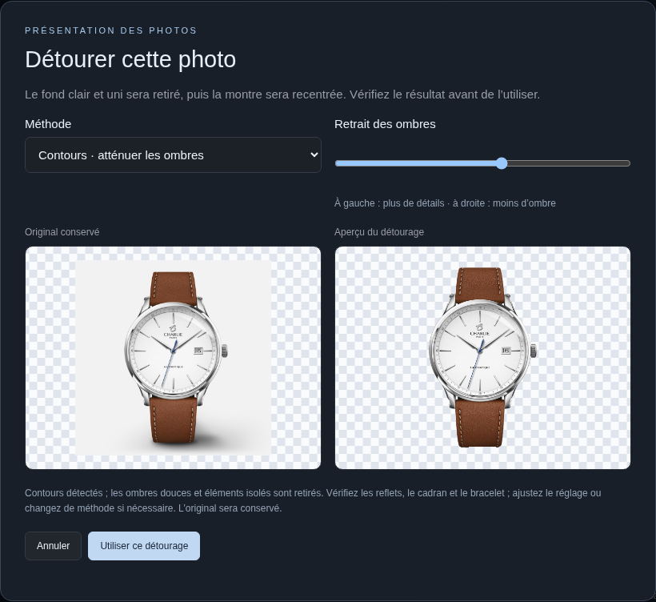

# Version 0.6.1 — gros carnets et détourage de la Charlie Slim

## Mise à jour

Remplacez **les deux fichiers `index.html` et `server.cjs`**, conservez `.env` et votre dossier de données, redémarrez le serveur, puis rechargez les navigateurs. Aucun paquet ni service supplémentaire à installer.

Une opération refusée par l'ancienne limite n'a pas été enregistrée : relancez-la après mise à jour. Les originaux, variantes, choix et anciens détourages déjà sauvegardés restent compatibles et ne sont pas retraités automatiquement.

## Carnets avec beaucoup de photos

L'ancienne limite de 28 Mo côté navigateur et de 30 Mo côté serveur bloquait rapidement une collection enrichie. La limite est désormais **100 Mo pour le JSON de collection**, y compris les images intégrées, les originaux et les détourages. L'import JSON accepte également 100 Mo. L'enveloppe de requête dispose de 2 Mo supplémentaires ; les petites routes de connexion et d'analyse conservent une limite distincte, plus basse.

Les originaux restent inchangés. Seuls les **nouveaux détourages** sont calculés avec un grand côté de 1 000 pixels, contre 1 600 auparavant, puis sauvegardés en PNG transparent. Cela réduit leur poids sans compression avec perte supplémentaire. Le résultat recadré peut légèrement dépasser 1 000 pixels à cause de la marge. La limite par nouvelle photo importée ou téléchargée reste 2 Mo ; celle du PNG détouré reste environ 2 Mo. Les anciens détourages ne sont pas recompressés.

Les brouillons et copies locales de la collection partagée sont maintenant enregistrés dans **IndexedDB**, dont la capacité est adaptée aux photos. L'ancien brouillon `localStorage` reste lisible pour la migration. Les écritures sont ordonnées pour qu'un ancien brouillon ne remplace pas une sauvegarde acquittée par le serveur. Si IndexedDB échoue, l'application tente l'ancien stockage ; si les deux sont bloqués ou saturés, elle demande un export avant fermeture. Le stockage local n'est pas une sauvegarde durable ; gardez vos exports et votre fichier serveur.

L'usage du HTML seul conserve son stockage local existant : cette amélioration des brouillons concerne la collection connectée au serveur. Aucun service externe n'est utilisé. La synchronisation et les exports transportent encore tout le JSON ; de très grandes collections coûteront donc davantage en mémoire et en transferts. Le choix conserve l'architecture simple à deux fichiers, sans service d'images séparé.

Si vous utilisez un reverse proxy, sa limite de requête doit aussi permettre cette taille. Exemple Nginx : `client_max_body_size 110M;`. Ce réglage ne concerne pas l'accès direct au serveur Node sur le port 8765.

## Détourage : deux méthodes et un aperçu réglable

Le simple retrait des pixels proches du fond pouvait garder une grosse ombre et retirer des reflets métalliques. La photo de la **Charlie Paris Initial Slim — Blanc** du carnet a servi de cas réel pour le correctif.

Dans **Détourer cette photo**, la méthode **Contours · atténuer les ombres** est proposée par défaut. Elle cherche les ruptures de contraste et les zones colorées, ferme les petites discontinuités de contour, conserve l'intérieur du sujet principal et écarte les éléments isolés. Le curseur **Retrait des ombres** recalcule l'aperçu : à gauche, le traitement conserve davantage de détails et d'ombre ; à droite, il écarte davantage les contrastes faibles.

La méthode **Fond uni · conserver davantage de détails** reste disponible. Elle retire seulement le fond clair relié aux bords, ce qui peut être préférable pour une montre très pâle ou plusieurs parties séparées.

Ce sont toujours des méthodes locales pour photos de catalogue sur fond clair, sans segmentation IA universelle. Un sujet clair mal délimité, une photo au poignet, plusieurs objets séparés ou une ombre dure peuvent donner un mauvais masque. Les détails fins au bord peuvent être légèrement rognés et une frange claire peut rester. Comparez le cadran, les cornes, la couronne et le bracelet ; changez de méthode ou annulez si nécessaire. L'algorithme ne reconstruit aucun détail.

La montre n'est enregistrée qu'avec **Utiliser ce détourage**. Le réglage et les changements de méthode dans l'aperçu ne sauvegardent rien. L'original est conservé, et **Retirer le détourage** permet de revenir en arrière. Pour remplacer un ancien résultat, ouvrez à nouveau le détourage : le calcul repart de l'original.

## Validation

La suite teste un carnet d'environ **49 Mo** avec de vraies images PNG décodables : passage dans l'ajout de photo, sauvegarde serveur, lecture dans un autre navigateur, panne réseau, brouillon IndexedDB, rechargement et reprise, export et import supérieurs à 30 Mo, refus avec retour arrière au-delà de 100 Mo.

La vraie photo Charlie est conservée comme fixture avec sa source documentée. Les tests vérifient le retrait de l'ombre au sol et la conservation du cadran, du bracelet et de la couronne dans le masque. L'aperçu réel ci-dessus a été inspecté visuellement. Les changements de méthode et de curseur, l'absence de sauvegarde pendant l'aperçu, le mobile et la conservation de l'original après validation sont également vérifiés.

Les tests des versions précédentes restent exécutés : synchronisation, conflits, photos, gestion, import de fiches et IA facultative, variantes par défaut, thèmes, exports et compatibilité des sauvegardes. Le correctif n'a pas été déployé sur votre homelab ni testé sur vos données privées.
