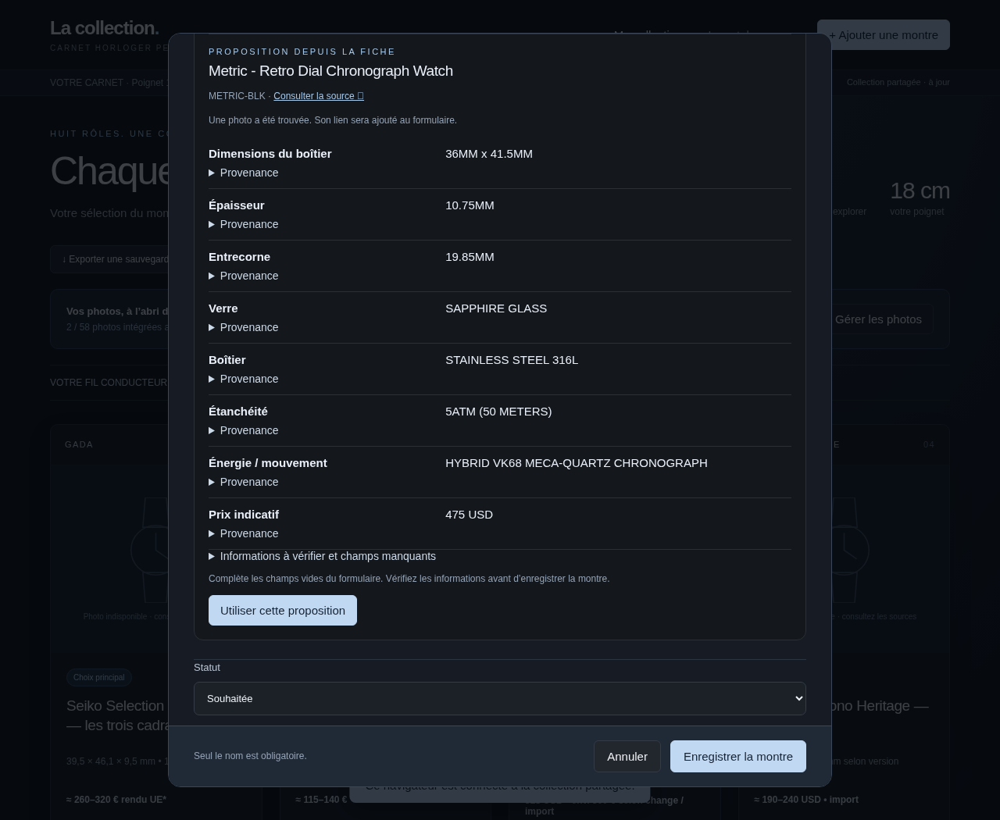

# Version 0.5 — ajout depuis une URL et analyse IA facultative

## Fonctionnement

Dans « Ajouter une montre », collez une fiche produit dans le champ « Fiche produit », puis cliquez « Analyser cette fiche ». Le serveur lit le HTML public et propose nom, référence, photo, prix et caractéristiques reconnues. Si plusieurs produits structurés figurent sur la page, choisissez d’abord la référence. Ce choix aide l’analyse, mais le texte peut encore contenir des recommandations d’autres montres : vérifiez la fiche concernée.

La proposition affiche les valeurs, les extraits sources et les champs manquants. « Utiliser cette proposition » complète les champs vides du formulaire ; vous pouvez les corriger. Vos notes personnelles, votre appréciation et votre statut restent dans leurs champs. Les informations ne sont enregistrées qu’avec « Enregistrer la montre ». Fermer le formulaire abandonne cet ajout.

La source, la date de relevé et les extraits sont conservés dans les sources et descriptions de la montre validée. Une photo proposée reste un lien externe ; l’outil « Gérer les photos » permet ensuite de la copier sur votre serveur.

La capture ci-dessous montre la proposition simple obtenue sur le HTML Brew Metric réellement consulté pendant le banc d’essai ; aucun appel IA n’a été effectué pour cette capture.



## Sans IA

**Aucune variable IA n’est nécessaire.** L’analyse simple par URL reste disponible avec le serveur et une connexion au carnet (`COLLECTION_PASSWORD`). Elle combine JSON-LD, métadonnées et libellés génériques anglais/français/japonais. Les valeurs ambiguës sont signalées, et certaines caractéristiques peuvent manquer. Les dimensions composites sont conservées comme telles.

Une page inaccessible, une protection antibot, une fiche construite uniquement par JavaScript ou un lien périmé peuvent empêcher l’import. Vous pouvez alors ajouter la montre manuellement. Le HTML autonome ou un hébergement purement statique restent utilisables en mode manuel ; ils ne disposent pas du serveur nécessaire pour consulter les fiches et appeler l’IA.

## Configurer le fournisseur

L’interface supportée est **OpenAI-compatible Chat Completions** : une requête JSON avec `model` et `messages`, une réponse contenant `choices[0].message.content`. Vous choisissez le fournisseur et le modèle. Les API natives Anthropic ou Gemini nécessitent leur interface compatible ou une passerelle ; elles ne sont pas directement interchangeables avec ce protocole.

Ajoutez ces variables dans **le même fichier privé que votre configuration serveur actuelle** :

```dotenv
AI_ENDPOINT=https://api.openai.com/v1/chat/completions
AI_MODEL=nom-du-modele-chez-votre-fournisseur
AI_API_KEY=votre-cle-privee
```

`AI_ENDPOINT` est l’URL complète de l’opération, avec `/chat/completions`, pas seulement un domaine ni une URL `/v1`. L’exemple OpenAI est un exemple de protocole, pas un fournisseur imposé. Aucun nom de modèle n’est prérempli : utilisez un modèle réellement disponible auprès de votre fournisseur.

Autres exemples d’endpoints :

| Service | Endpoint |
| --- | --- |
| OpenRouter | `https://openrouter.ai/api/v1/chat/completions` |
| Ollama local avec interface compatible | `http://127.0.0.1:11434/v1/chat/completions` |
| LM Studio local avec interface compatible | `http://127.0.0.1:1234/v1/chat/completions` |

Ces exemples n’ont pas été appelés avec une clé réelle lors du développement. Pour un modèle local, mettez le nom exact du modèle installé dans `AI_MODEL`. `AI_API_KEY` est facultative si le service local ne demande pas d’authentification. Si une clé est fournie, elle est envoyée uniquement au fournisseur sous `Authorization: Bearer …`. La machine qui exécute le carnet doit pouvoir joindre l’endpoint choisi ; `127.0.0.1` désigne cette machine. Les URL HTTP sont acceptées pour vos services locaux ; utilisez HTTPS vers un fournisseur distant.

Le fichier `.env` n’est pas chargé automatiquement. Si vous utilisez ce fichier à côté de `server.cjs`, lancez avec Node **20.6 ou plus récent** :

```sh
node --env-file=.env server.cjs
```

Avec le service systemd fourni, ajoutez les variables dans `/etc/watch-collection.env`, puis :

```sh
sudo systemctl restart watch-collection
```

Pour la mise à jour, remplacez `index.html` et `server.cjs`, conservez votre fichier privé et le dossier de données, puis redémarrez. Rechargez chaque navigateur et reconnectez-le au carnet. Aucune installation npm ni migration des données n’est nécessaire.

Si l’endpoint ou le modèle manque, ou si l’URL de configuration est invalide, l’IA reste désactivée. Vous pouvez retirer ces variables pour revenir au mode sans IA. Une clé manquante sur un fournisseur qui en exige une provoquera un échec de l’appel, avec maintien de la proposition simple.

## Utiliser l’IA

Lorsque le serveur détecte la configuration, le formulaire affiche « Enrichir avec l’IA ». **La case est désactivée par défaut à chaque ouverture du formulaire.** Cochez-la pour la fiche à analyser ; le contenu public de la page sera transmis au fournisseur configuré. Un import simple n’appelle jamais l’IA.

L’IA reçoit uniquement le texte de la fiche, son URL et les données produit proposées. Ni la collection complète, ni vos notes, ni le mot de passe du carnet ne lui sont envoyés. L’endpoint, le modèle et la clé restent sur le serveur ; ils ne sont pas exposés par le navigateur ou les exports. Le traitement des données et les éventuels frais dépendent du fournisseur choisi. Le carnet ne calcule pas ces frais.

L’entrée est limitée aux premiers 60 000 caractères du texte et aux données produit résumées. Le serveur n’envoie pas les photos au modèle. Le délai d’appel IA est de 45 secondes, avec deux analyses de fiches simultanées au maximum. La requête n’impose ni tools, ni `response_format`, ni paramètre de température pour rester compatible avec davantage de fournisseurs. Le modèle doit néanmoins savoir suivre la consigne et produire du JSON.

L’analyse est indépendante du style HTML propre à une marque : elle interprète le texte récupéré. Elle ne recherche pas librement sur le Web, ne découvre pas automatiquement toutes les couleurs et ne calcule pas encore une compatibilité avec votre poignet.

## Contrôles et limites

Le serveur traite la page comme des données non fiables et demande d’ignorer les instructions qu’elle pourrait contenir. Il ne donne au modèle aucun outil, secret ou accès à votre collection. Les réponses sont validées et les textes affichés sont échappés.

Chaque caractéristique IA doit avoir un extrait retrouvé dans le contenu transmis. Pour les caractéristiques chiffrées, les nombres proposés doivent figurer dans cet extrait ; une valeur calculée ou convertie peut donc être refusée. Le corne à corne exige un extrait explicitement libellé ainsi ; une simple dimension verticale n’est pas convertie automatiquement. Une référence différente de celle structurée ne la remplace pas, et le prix structuré garde sa devise d’origine. Les propositions rejetées sont signalées.

**Ces contrôles ne prouvent pas que l’interprétation est correcte** : un extrait peut parler d’un autre produit, une unité peut être mal comprise, ou une condition omise. Les champs retenus doivent être relus. Les rôles proposés par l’IA sont des suggestions vérifiables avant sauvegarde. Les données absentes ne sont pas inventées.

Une erreur réseau, un timeout, une réponse de fournisseur non compatible, un JSON invalide ou l’absence de propositions suffisamment justifiées laisse la proposition simple disponible. Les messages retournés n’exposent ni la clé ni le corps brut d’erreur du fournisseur. Vérifiez votre endpoint, votre modèle et la configuration de votre service si les appels échouent.

Le téléchargement des fiches utilise HTTPS avec validation TLS, contrôle des adresses publiques et vérification de chaque redirection, un délai de 15 secondes par requête et une limite de 4 Mo. Le serveur de production ne prend pas en charge un proxy d’entreprise pour cette opération. Sur le cloud de développement, les vrais sites ont été consultés via son proxy ; le téléchargement HTTPS direct depuis votre homelab reste à vérifier. Les paramètres IA sont choisis uniquement dans la configuration de votre serveur ; ils peuvent donc pointer vers votre modèle local, tandis que les URL produit privées sont refusées.

## Validation effectuée

La suite teste un **fournisseur compatible simulé**, avec de vraies requêtes HTTP : endpoint choisi, modèle, authentification Bearer, données privées exclues, extraits absents et nombres inventés rejetés, panne fournisseur, JSON invalide et redirection refusée. Elle vérifie aussi l’aperçu sans sauvegarde, la correction/validation, la provenance, un second navigateur, l’annulation, le mode sans IA, la sélection entre produits et l’affichage mobile. Les fonctions existantes de gestion et de synchronisation restent couvertes par leurs tests.

Aucun fournisseur payant ni modèle local réel n’a été appelé : compatibilité et qualité avec votre modèle devront être vérifiées sur votre installation. Le [banc d’essai des sites réels](banc-essai-import.md) fournit des références pour cette vérification.

## Correctif Certina — version 0.6.2

Une lecture ciblée des champs Certina améliore aussi les imports sans IA : référence, dimensions, calibre, verre, prix du marché et photo originale. En mode IA, seules les informations de la montre affichée sont transmises, sans recommandations ni infobulles générales. Voir [le diagnostic et la mise à jour](import-certina.md).
