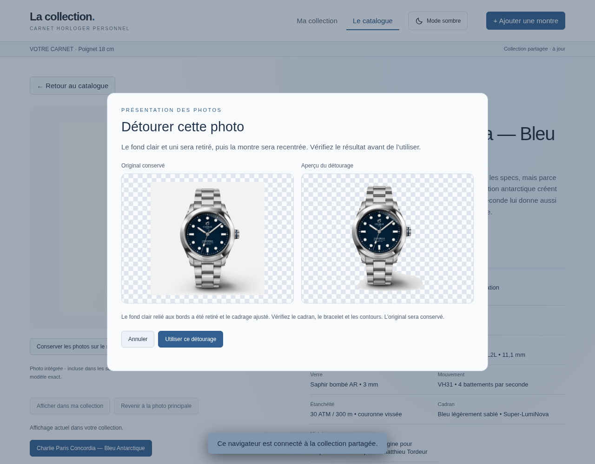

# Version 0.6 — favicon, mode clair et détourage local

## Mise à jour

Remplacez `index.html` et `server.cjs`, conservez votre `.env` et le dossier de données, puis redémarrez le serveur et rechargez tous les navigateurs. Aucun paquet, service supplémentaire ou changement de configuration n’est nécessaire.

Les anciennes sauvegardes sont compatibles. Les pages d’une ancienne version doivent être rechargées avant de sauvegarder : le serveur les bloque pour empêcher la perte des détourages déjà enregistrés.

## Favicon

Une petite montre apparaît dans l’onglet du navigateur. Le favicon SVG et son alternative PNG sont intégrés directement dans le HTML : ils fonctionnent également dans le carnet exporté, sans fichier d’icône à copier sur le serveur. Rechargez la page pour remplacer l’ancienne icône.

## Mode clair

Cliquez sur **Mode clair / Mode sombre** dans la barre de navigation. Sur mobile, le bouton affiche un soleil ou une lune ; son libellé est accessible aux lecteurs d’écran.

Le thème couvre la collection, le catalogue, les fiches, les formulaires, les fenêtres de connexion/import et les dialogues de photos. La disposition et les fonctionnalités restent les mêmes. Le mode sombre est le défaut initial, conformément au style choisi pour le projet.

La préférence est mémorisée dans le navigateur pour cette adresse. Elle peut donc être différente sur un autre appareil ; elle n’est pas une modification de la collection partagée. Si le navigateur refuse le stockage local, le changement fonctionne pour la session, sans garantie de mémorisation.

## Détourer une photo

1. Ouvrez la fiche et choisissez la variante ou la photo de galerie souhaitée.
2. Cliquez sur **Détourer cette photo**.
3. Comparez l’original et l’aperçu. Vérifiez le cadran, le bracelet, les contours et les zones très claires.
4. Cliquez sur **Utiliser ce détourage** pour l’enregistrer, ou **Annuler**.

Le calcul est effectué dans votre navigateur, sans IA générative ni service externe. Il retire le fond clair et uniforme relié aux bords de l’image, puis recadre le sujet avec une marge. Le rendu utilise une scène et un cadrage homogènes dans les cartes et sur la fiche. Une photo déjà transparente peut également être recentrée.

Le traitement est facultatif et se fait photo par photo. Parcourir une variante ou détourer une autre photo ne change pas le choix de couleur de votre collection ; utilisez **Afficher dans ma collection** si vous souhaitez aussi choisir cette illustration par défaut.

### Ce qui est conservé

L’original reste stocké avec la photo ; le PNG détouré est enregistré à côté, dans les données de cette même photo. Les associations des variantes et les choix de collection restent valides. **Retirer le détourage** réaffiche l’original.

En mode connecté, original et détourage font partie de la sauvegarde partagée : ils sont retrouvés depuis les autres navigateurs et inclus dans les exports JSON et HTML. Une page d’ancienne version ne peut pas les effacer silencieusement. Fermer ou annuler l’aperçu ne sauvegarde rien.

Pour une photo distante, le navigateur demande d’abord une copie au serveur du carnet, qui utilise le téléchargement de photos déjà sécurisé. Les sources alternatives de la fiche sont essayées si nécessaire. L’aperçu reste temporaire ; la copie originale et le détourage sont intégrés à la collection lors de la validation. Aucune image n’est envoyée au fournisseur IA configuré pour l’analyse de fiches.

Sans serveur connecté, le détourage fonctionne sur les photos déjà intégrées au HTML ou importées depuis un fichier. Une photo distante nécessite votre serveur connecté ou l’import d’un fichier local, car les sites tiers ne permettent pas systématiquement le traitement dans un canvas.

### Limites

Ce traitement simple vise les photos de catalogue sur fond **clair, neutre et uni**. Il ne réalise pas une segmentation universelle : photos au poignet, paysages, fonds colorés ou sombres ne sont pas pris en charge. Pour ces cas, importez une photo PNG déjà détourée.

Le traitement est conservateur pour préserver les zones claires enfermées dans le cadran. Des ombres, un logo ou des espaces blancs internes peuvent rester. Inversement, un détail très clair qui touche le fond peut être retiré. L’aperçu et la conservation de l’original sont donc essentiels ; ne validez pas un résultat qui altère la montre. Il ne reconstruit aucun cadran ni détail.

Le côté le plus long est limité à 1 600 pixels pour le traitement, et le PNG résultat à environ 2 Mo. Les images supérieures à 40 millions de pixels sont refusées. Une image peut être redimensionnée avant le calcul ; l’original conserve sa résolution. Originaux et résultats augmentent la taille de la collection, dont la limite reste celle du carnet existant.

La capture ci-dessous montre un essai sur la vraie photo Concordia déjà embarquée dans le magazine. Le fond a été retiré ; l’ombre reste partiellement visible. Ce résultat illustre aussi les limites de l’algorithme.

## Validation

Les tests vérifient le favicon décodable, les modes clair/sombre et leur mémorisation, le mobile, le retrait du fond blanc relié aux bords, la conservation d’un cadran blanc enfermé et des valeurs RGB de détails colorés d’une image de test. Ils vérifient aussi le refus d’un fond sombre, le recadrage transparent, l’aperçu sans sauvegarde, l’annulation, l’original et le retour arrière, le second navigateur, les exports dont le HTML autonome et le rejet d’une ancienne page.

Le rendu clair et les dialogues ont été inspectés sur ordinateur et mobile. Le détourage a également été essayé visuellement sur la photo Concordia ci-dessus ; il n’a pas été validé automatiquement pour toutes les photos de la collection.
